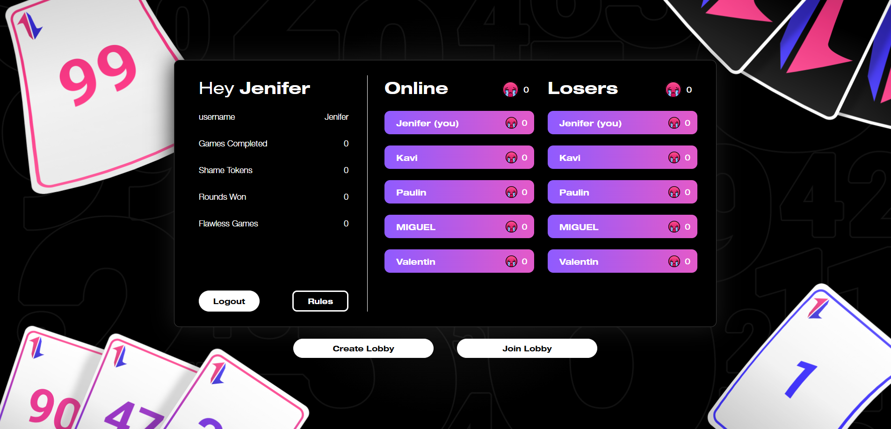
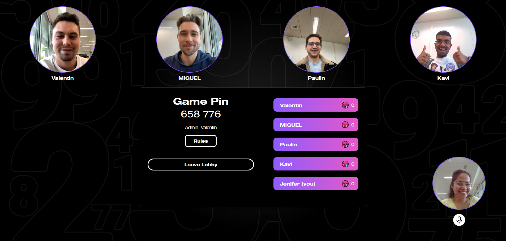
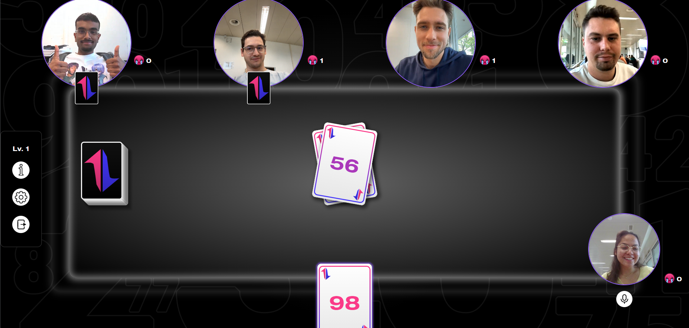

# DeGame

Welcome to our version of Steffen Brendorff's card game "The Game" that promotes teamwork and having fun with eachother.

<p align="center">
	
</p>

## Table of contents
1. [Motivaiton & Game Rules](#motivation--game-rules)
2. [Technologies](#technologies)
3. [High-level components](#high-level-components)
4. [Launch & Deployment](#launch--deployment)
5. [Illustrations](#illustrations)
6. [Roadmap](#roadmap)
7. [Authors & Acknowledgement](#authors--acknowledgement)
8. [License](#license)

## Motivation & Game Rules

There is an existing card game called “The Game” by Steffen Brendorff that we played when first sitting together in our SoPra-group. We thought to ourselves that this is a very fun game that also lets a group of people get to know each other in a way that is not very typical. It allows the players to get to know the way of thinking of their group members. Additionally, we have not found an existing online version of “The Game” so this was definitely a hole we wanted to fill.

Our version “De Game” is inspired heavily by “The Game”. It is an online version of the card game where all the players compete against De Game as a team. De Game contains 99 cards that each have a number on it, namely numbers 1 through 99. The goal of the game is to play the cards that are in the players hands in ascending order. At the beginning of the first round, everyone receives one card (Level 1). When the cards in play are not played in the correct order there is no “level up” and the next round is again played in level 1. This means that every player again receives one card. An important point is that all the cards that were in play will no longer be in the game. They can be revealed which can help for people that are good at counting cards. When all the cards are played in the correct order the group of players levels up to the next level. In level two, every player receives two playing cards. This goes on until there are no longer enough cards on the stack to start a round in the corresponding level. 

Our SoPra-group likes to have fun and also to make fun of each other (in a respectful way, of course). Thus, we decided to add a fun feature, namely, “Shame Tokens”. When a player plays their card and it was not their turn because there is a lower card value in play, this player will receive a “Shame Token”. This gives the other players in the group a numeric value of shame that can be given to a player. It is important to notice that shame tokens are not something that is positive because De Game is a game that promotes teamwork. Collecting shame tokens is what leaves you on the “Loserboard” (opposite pole of usual leaderboards).

## Technologies

These are the technologies used in the client:
- [TypeScript](https://www.typescriptlang.org/)
- [CSS](https://sass-lang.com/)
- [React](https://react.dev/)  
- [SonarCloud](https://www.sonarsource.com/products/sonarcloud/) 
- [Figma](https://www.figma.com/)
- [Agora](https://www.agora.io/en/)

## High-level components

### Home

The `Home` page is the first page you see when visiting our deployed [Website](https://sopra-fs24-group-33-client.oa.r.appspot.com/home). From here you can choose to register as a User, log in if you are already a User or to just log in as a Guest User (via `Register` or `Login`). Choosing the Guest User route will result in games and shame tokes not being saved to the User.

### Overview

The `Overview` page is divided into three parts. The left-most part shows user-specific information. Here you can see your username, number of shame tokens, number of games completed (only for registered users), number of rounds won (only for registered users), and number of flawless games (only for registered users).

In the middles section, a list of online players is shown. This acts as a helper when wanting to check whether or not your friends are online. 

On the right-hand side, a list of `Loser`s is found. The list shows a list of registered users sorted by highest amount of shame tokens. 

At the bottom of the page, there are two buttons `Create Lobby` and `Join Lobby`. The first button leads to a new lobby. The second buton releases a pop-up where an existing game pin can be entered, which leads to said game lobby.

### Lobby

In the `Lobby` view, the video call begins. Alongside the video streams of yourself and your teamplayers you can see how many more people could join a game (2 to 5 players). Additionally, the game pin is visible. This pin is used, so that other players can enter the lobby. The admin of the game (player that created the lobby) can start the game as soon as at least 2 and at most 5 players are in the lobby.

### GameArena

Here is where the game is played. In the `GameArena` all video stream are displayed, as well as the number of shame tokens a player has. 

In the middle of the page is the game table. Here, the cards that have been played are visible as well as a placeholder of the stack of cards indicating how many more cards are in the game. 

On the left-hand side, there is a mini navigation menu that allows a player to see the current level, read the rules, change viewing settings, and end the game (caution: this ends the game for all players).

## Launch & Deployment

### Prerequisites and Installation
For your local development environment, you will need Node.js.\
We urge you to install the exact version **v20.11.0** which comes with the npm package manager. You can download it [here](https://nodejs.org/download/release/v20.11.0/).\
If you are confused about which download to choose, feel free to use these direct links:

- **MacOS:** [node-v20.11.0.pkg](https://nodejs.org/download/release/v20.11.0/node-v20.11.0.pkg)
- **Windows 32-bit:** [node-v20.11.0-x86.msi](https://nodejs.org/download/release/v20.11.0/node-v20.11.0-x86.msi)
- **Windows 64-bit:** [node-v20.11.0-x64.msi](https://nodejs.org/download/release/v20.11.0/node-v20.11.0-x64.msi)
- **Linux:** [node-v20.11.0.tar.xz](https://nodejs.org/dist/v20.11.0/node-v20.11.0-linux-x64.tar.xz) (use this [installation guide](https://github.com/nodejs/help/wiki/Installation#how-to-install-nodejs-via-binary-archive-on-linux) if you are new to Linux)

If you happen to have a package manager the following commands can be used:

- **Homebrew:** `brew install node@20.11.0`
- **Chocolatey:** `choco install nodejs-lts --version=20.11.0`

After the installation, update the npm package manager to **10.4.0** by running ```npm install -g npm@10.4.0```\
You can ensure the correct version of node and npm by running ```node -v``` and ```npm --version```, which should give you **v20.11.0** and **10.4.0** respectively.\
Before you start your application for the first time, run this command to install all other dependencies, including React:

```npm install```

Next, you can start the app with:

```npm run dev```

Now you can open [http://localhost:3000](http://localhost:3000) to view it in the browser.\
Notice that the page will reload if you make any edits. You will also see any lint errors in the console (use a Chrome-based browser).\
The client will send HTTP requests to the server which can be found [here](https://github.com/HASEL-UZH/sopra-fs24-template-server).\
In order for these requests to work, you need to install and start the server as well.

#### Testing
Testing is optional, and you can run the tests with `npm run test`\
This launches the test runner in an interactive watch mode.\
See the section about [running tests](https://facebook.github.io/create-react-app/docs/running-tests) for more information.

> For macOS user running into a 'fsevents' error: https://github.com/jest-community/vscode-jest/issues/423

#### Build
Finally, `npm run build` builds the app for production to the `build` folder.<br>
It correctly bundles React in production mode and optimizes the build for the best performance:\
The build is minified, and the filenames include hashes.<br>

See the section about [deployment](https://facebook.github.io/create-react-app/docs/deployment) for more information.

## Illustrations

<p align="center">
	
</p>

`Home` page

<p align="center">
	
</p>

`Overview` page

<p align="center">
	
</p>

`Lobby` page

<p align="center">
	
</p>

`GameArena` page

## Roadmap

### Additional colour themes

An additional feature that could be added would be to allow users to switch between themes throughout the website. Maybe add a "light-mode" in contrast to our "dark-mode".

### Additional amimations

To enhance the user experience, animations of some sort could be implemented. For example moving elements in the background, which would allow for a less static feel.

## Authors & Acknowledgement

- [Valentin Ambass](https://github.com/kungfuvali)
- [Miguel Meier](https://github.com/usamike25)
- [Jenifer Meyer](https://github.com/jeniferleleanymeyer)
- [Paulin Roth](https://github.com/Paulin3000)
- [Kavishan Srirangarasa](https://github.com/kauii)

## License

# TODO